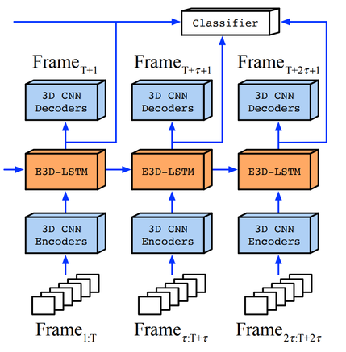

# E3D-LSTM

It contains a Tensorflow implementation of the following paper:

* [**Eidetic 3D LSTM: A Model for Video Prediction and Beyond**](https://openreview.net/forum?id=B1lKS2AqtX), ICLR 2019.

*Please note that this is not an officially supported Google product.*

If you find this code useful in your research then please cite

```
@inproceedings{wang2019eidetic,
  title={Eidetic 3D LSTM: A Model for Video Prediction and Beyond},
  author={Wang, Yunbo and Jiang, Lu and Yang, Ming-Hsuan and Li, Li-Jia and Long, Mingsheng and Fei-Fei, Li.},
  booktitle={ICLR},
  year={2019}
}
```


We present a new model, Eidetic 3D LSTM (E3D-LSTM), that integrates
3D convolutions into RNNs. The encapsulated 3D-Conv makes local perceptrons
of RNNs motion-aware and enables the memory cell to store better short-term
features. We evaluate the E3D-LSTM network on (a) future video prediction
(for unsupervised video representation learning) and early activity
recognition to infer what is happening or what will happen after observing
only limited frames of video.




## Setup

All code was developed and tested on Nvidia V100 the following environment.

- Python 2.7
- opencv3
- scikit-image
- numpy
- tensorflow>=1.0
- cuda>=8.0
- cudnn>=5.0

Please download the data via the following external links.

* [Moving MNIST](https://www.dropbox.com/s/fpe24s1t94m87rn/moving-mnist-example.tar.gz?dl=0) is a dataset with two moving digits bouncing in a 64 by 64 area.
* [KTH Actions](https://www.dropbox.com/s/ppmob712dzgogly/kth_action.tar.gz?dl=0) is a human action dataset. This dataset contains frames from original videos. It selects the reasonable, predictable ones and resize them.


## Quick Start

To train our model on the Moving NIST dataset using:

```
python -u run.py \
    --is_training True \
    --dataset_name mnist \
    --train_data_paths ~/data/moving-mnist-example/moving-mnist-train.npz \
    --valid_data_paths ~/data/moving-mnist-example/moving-mnist-valid.npz \
    --pretrained_model pretrain_model/moving_mnist_e3d_lstm/model.ckpt-80000 \
    --save_dir checkpoints/_mnist_e3d_lstm \
    --gen_frm_dir results/_mnist_e3d_lstm \
    --model_name e3d_lstm \
    --allow_gpu_growth True \
    --img_channel 1 \
    --img_width 64 \
    --input_length 10 \
    --total_length 20 \
    --filter_size 5 \
    --num_hidden 64,64,64,64 \
    --patch_size 4 \
    --layer_norm True \
    --sampling_stop_iter 50000 \
    --sampling_start_value 1.0 \
    --sampling_delta_per_iter 0.00002 \
    --lr 0.001 \
    --batch_size 4 \
    --max_iterations 1 \
    --display_interval 1 \
    --test_interval 1 \
    --snapshot_interval 10000
```

A full list of commands can be found in the script folder.
The training script has a number of command-line flags that you can use to configure the model architecture, hyperparameters, and input / output settings.
Below are the parameters about our model:

- `--model_name`: The model name. Default value is `e3d_lstm`.
- `--pretrained_model`: Directory to find our pretrained models. See below for the download instruction.
- `--num_hidden`: Comma separated number of units of e3d lstms
- `--filter_size`: Filter of a single e3d-lstm layer.
- `--layer_norm`: Whether to apply tensor layer norm.

`scheduled_sampling`, `sampling_stop_iter`, `sampling_start_value` and `sampling_changing_rate` are hyperparameters used for scheduled sampling in training. The standard parameters for training and testing are:

- `--is_training`: Is it training or testing.
- `--train_data_paths`, `--valid_data_paths`: Training and validation dataset path.
- `--gen_frm_dir`: Directory to store the prediction results.
- `--allow_gpu_growth`: Whether allows GPU to grow.
- `--input_length 10`: Input sequence length.
- `--total_length 20`: Input and output sequence length in total.


To test a model, set `--is_training False`.

## Pretrained Models

First download our pretrained models. You can test it on the dataset:

* [Moving MNIST](https://storage.googleapis.com/e3d_lstm/pretrained_models/moving_mnist_e3d_lstm_pretrain.zip)
* [KTH Actions](https://storage.googleapis.com/e3d_lstm/pretrained_models/kth_e3d_lstm_pretrain.zip)

